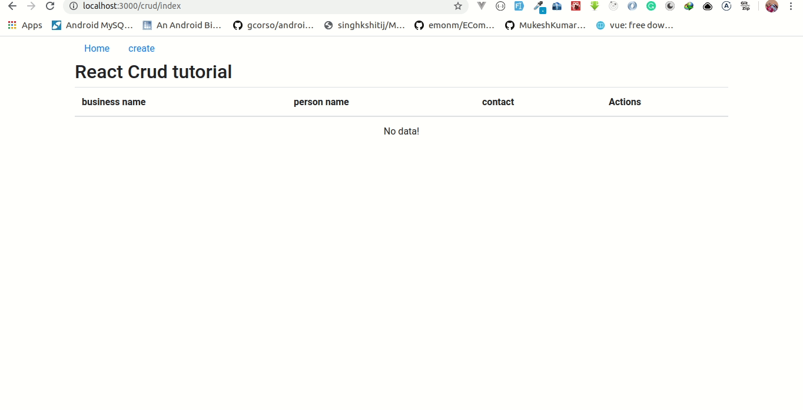

# [Simple React Crud App](https://davis67.github.io/simple-react-app/)

A simple react app that stores data in an array.Dont worry the next app will cover local storage, and we shall buid a backend server after that

## Demo

[https://davis67.github.io/simple-react-app/](https://davis67.github.io/simple-react-app/)

## Prerequisites

- [Node js](https://nodejs.org/en/) installed on your machine
- A package manager [npm](https://www.npmjs.com/) or [yarn](https://yarnpkg.com/lang/en/)
- [Git](https://git-scm.com/) Version Control System

## Installation

- Clone the repo locally to your machine `git clone https://github.com/davis67/simple-react-app.git`

- Install package dependencies `yarn` or `npm install` depending on which package manager you are using

- Run `npm run start` or `yarn start` to compile and boot up a development server

- Run `npm run build` or `yarn build` to minimize and compile the code for production
